# オンラインコミュニティ - YNot

## インフラ構成



## 環境構築

1. クローンする

```
git clone git@github.com:hiromu-ikeda/gesalon-web.git
```

2. Docker 環境をビルドする

```
sh local_docker.sh build
```

3. コンテナを立ち上げる

```
sh local_docker.sh up
```

※コンテナを止めるとき

```
sh local_docker.sh down
```

## 概要

YNot と称するオンラインコミュティです。

下記のようなコンテンツをご用意しております。

- 独自コンテンツの閲覧
- コミュニティ会員同士の交流
- フリーランス向け案件紹介
